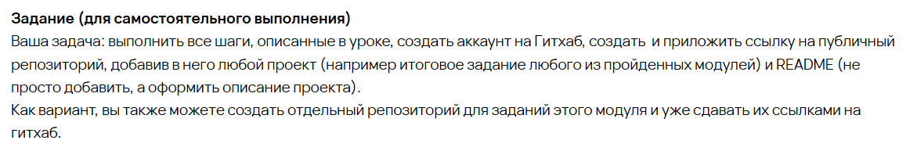

# Учебный проект: знакомство с GitHub

Этот репозиторий создан в рамках учебного задания по работе с GitHub.  
Здесь размещён небольшой учебный проект и оформлен README с описанием.
## Что было сделано
- Добавлен учебный Python-проект из модуля по ООП
- Оформлен README с использованием Markdown
- Добавлен скриншот текста задания
- Запланировано создание отдельного репозитория для модуля
  «Алгоритмы и структуры данных»